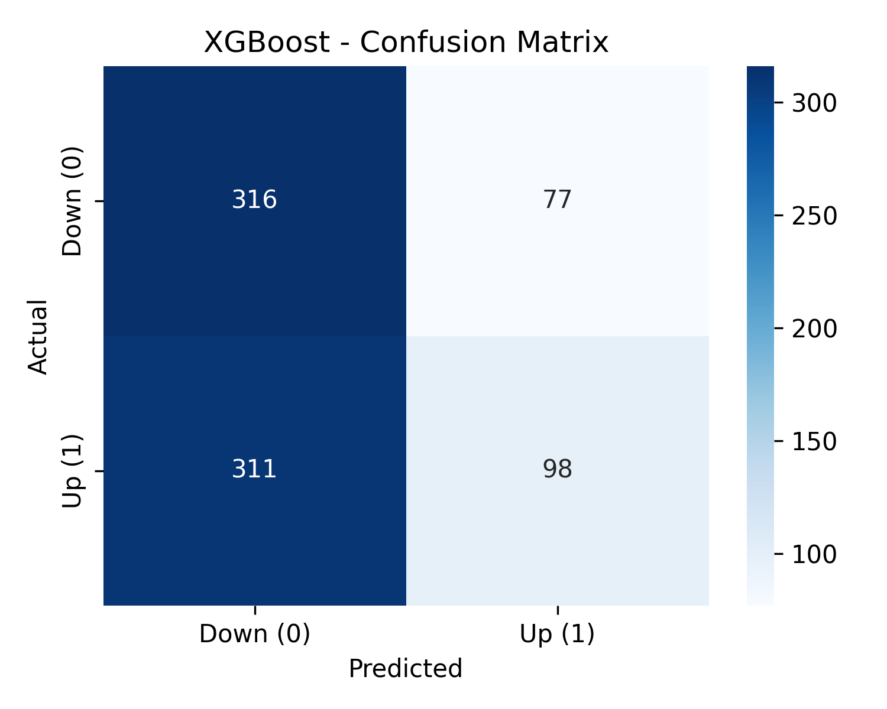
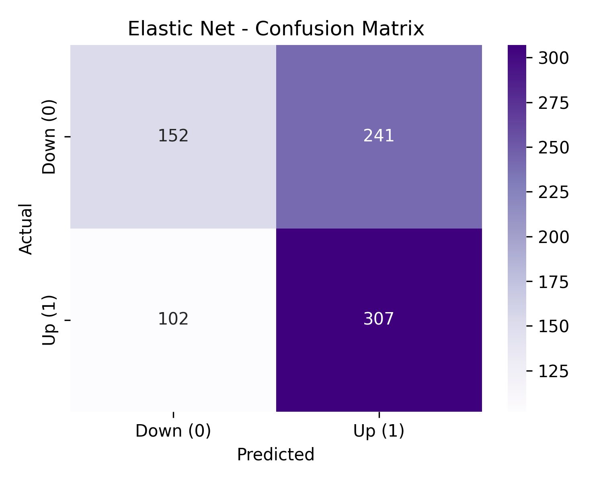
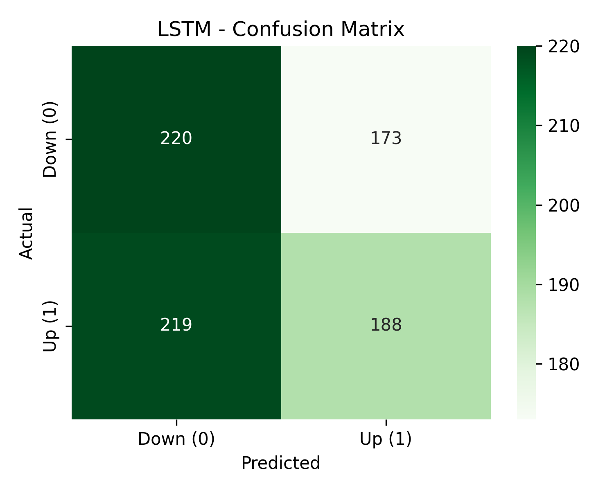
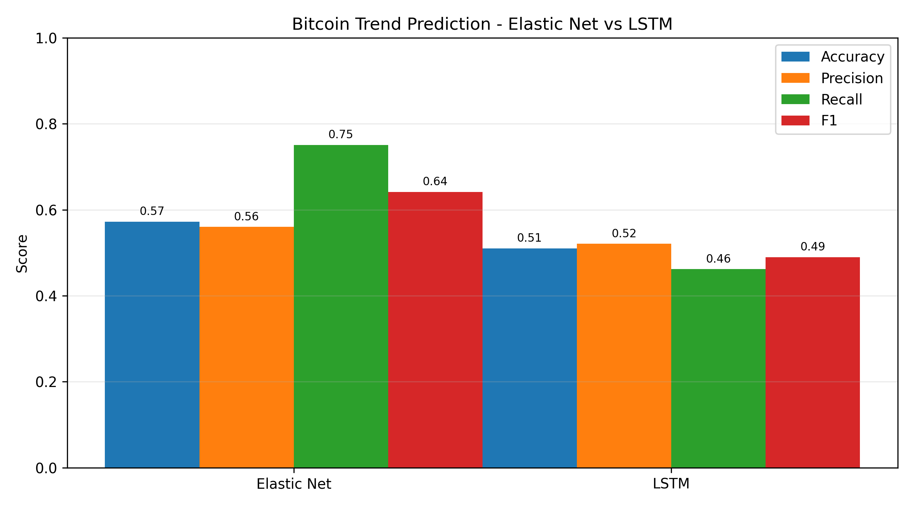
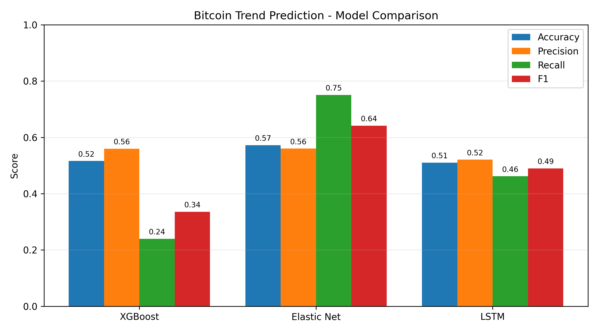

-informational)


---

# Bitcoin Price / Trend Predictor

A comparative study of **Elastic Net**, **XGBoost**, and **LSTM deep learning** for:
- **Next-day Bitcoin price prediction (regression)**
- **Next-day price trend direction (UP or DOWN classification)**

---

## Table of Contents
- [Overview](#project-overview)
- [Dataset](#dataset)
- [Methodology](#methodology)
  - [Price Prediction (Regression)](#price-prediction-regression)
  - [Trend Prediction (Classification)](#trend-prediction-classification)
- [Evaluation Metrics](#evaluation-metrics)
- [Results](#final-results)
  - [Price Prediction](#price-prediction-regression)
  - [Trend Prediction](#trend-prediction-classification)
- [Visualizations](#visualizations)
- [Key Insight](#key-insight)
- [Reproducibility](#reproducibility)
- [Team Members](#team-members)
- [License](#license)

---

## Project Overview
Cryptocurrency markets are extremely volatile and reactive to external events, making it difficult to model.  
This project compares three AI model families to determine which approach generalizes best on daily Bitcoin price data:

| Model Type | Model | Category |
|------------|--------|----------|
| Linear ML | Elastic Net | Baseline |
| Ensemble ML | XGBoost | Tree-based |
| Deep Learning | LSTM | Neural Network |

**Our Goals:**
1. **Price Prediction** → Forecast exact next-day closing price  
2. **Trend Prediction** → Predict whether price will go **UP (1)** or **DOWN (0)**

---

## Dataset
- **4008 daily Bitcoin price records (2014 → 2025)**
- **109 engineered technical indicators**
  (RSI, MACD, moving averages, volatility measures, bull/bear regime flags, etc.)

Targets:
| Task | Target Column | Meaning |
|------|--------------|---------|
| Price Prediction | `future_close` | Tomorrow's closing price for the next day (t + 1) |
| Trend Prediction | `Target` | 1 if Close > Open, else 0 |

---

## Methodology 

### Price Prediction (Regression)
1. Load dataset → sort chronologically
2. Create regression label: `future_close = close.shift(-1)`
3. Handle missing values (forward/back fill)
4. Drop non-numeric features
5. **X = technical indicators**, **y = future_close**
6. StandardScaler applied (Elastic Net & LSTM only)
7. **Time-based split:** 70% Train • 15% Validation • 15% Test
8. Train models:
   - Elastic Net Regression
   - XGBoost Regressor
   - LSTM Regression
9. Evaluate using:
   - MAE, RMSE, R², and **Directional Accuracy**
10. Generate price-tracking plots and loss curves

### Trend Prediction (Classification)
1. Load dataset → drop non-numeric columns
2. Forward & backward fill missing values
3. **X = technical indicators**, **y = Target (0/1)**
4. **Train/test split:** 80% Train • 20% Test
5. Train models:
   - XGBoost Classifier
   - Elastic Net (Logistic)
   - LSTM Binary Classifier
6. Evaluate using:
   - Accuracy, Precision, Recall, F1-Score
7. Generate confusion matrices & model comparison charts

---

## Evaluation Metrics

### Price Prediction (Regression)

| Metric | Meaning |
|--------|---------|
| MAE | Mean Absolute Error – average absolute difference between predicted and actual price |
| RMSE | Root Mean Squared Error – penalizes larger errors more strongly |
| R² | Coefficient of Determination – how much variance in price is explained by the model |
| Directional Accuracy | % of days where the model correctly predicted UP vs DOWN price movement |

### Trend Prediction (Classification)

| Metric | Meaning |
|--------|---------|
| Accuracy | Overall % of correctly classified UP/DOWN days |
| Precision | Of the days predicted **UP**, how many were actually UP |
| Recall | Of the days that were actually **UP**, how many the model correctly caught |
| F1-Score | Combines precision and recall to measure how well the model avoids both false positives and false negatives |

---

## Final Results

### Price Prediction (Regression)
| Model | MAE ↓ | RMSE ↓ | R² ↑ | Directional Accuracy |
|--------|-----------|-------------|-----------|----------------------|
| **Elastic Net** | **2024** | **2639** | **0.985** | **51.5%** |
| XGBoost | 21052 | 28466 | −0.757 | 50.7% |
| LSTM | 81040 | 83839 | −14.24 | 47.0% |

**Elastic Net predicted price movement best and generalized better than both XGBoost and LSTM.**

---

### Trend Prediction (Classification)
| Model | Accuracy | Precision | Recall | F1-Score |
|--------|-----------|-----------|--------|----------|
| XGBoost | 0.528 | 0.536 | 0.556 | 0.546 |
| **Elastic Net** | **0.572** | **0.560** | **0.751** | **0.642** |
| LSTM | 0.510 | 0.521 | 0.462 | 0.490 |

**Elastic Net again outperformed other models especially in detecting UP trends (high recall).**

---

## Visualizations
All generated plots are stored in:
`/notebooks/reports/figures/`

---

### Price Prediction

#### Elastic Net – Actual vs Predicted
  
<p align="center"><i>Elastic Net closely tracks price volatility and the overall market trend.</i></p>

#### XGBoost – Actual vs Predicted
  
<p align="center"><i>XGBoost overfits to price spikes, resulting in exaggerated and unstable predictions.</i></p>

#### Elastic Net vs XGBoost – Comparison
  
<p align="center"><i>Elastic Net demonstrates smoother and more realistic price forecasting compared to XGBoost.</i></p>

---

### Trend Prediction (Up / Down)

#### XGBoost - Confusion Matrix
  
<p align="center"><i>XGBoost favors the majority class and shows weak recall for upward movements.</i></p>

#### Elastic Net - Confusion Matrix
  
<p align="center"><i>Elastic Net achieves the highest recall and overall F1-score for trend classification.</i></p>

#### LSTM - Confusion Matrix
  
<p align="center"><i>LSTM prediction errors are higher and more randomly distributed due to unstable learning.</i></p>

#### Elastic Net vs LSTM - Trend Comparison
  
<p align="center"><i>Elastic Net significantly outperforms LSTM across all classification metrics.</i></p>

---

### Multi-Model Performance
#### Overall Model Comparison (Accuracy, Precision, Recall, F1)
  
<p align="center"><i>Elastic Net provides the best balance across metrics; LSTM and XGBoost underperform on trend classification.</i></p>

---

### Training Diagnostics

#### LSTM - Training / Validation Loss Curve
  
<p align="center"><i>Validation loss remains high despite decreasing training loss meaning poor generalization and confirming severe overfitting.</i></p>

---

## Key Insight
> More complexity does **not** mean better performance in cryptocurrency forecasting.  
> **Elastic Net outperformed both XGBoost and LSTM** in **both price prediction and trend classification**, due to robustness against volatility and noise.

---

## Reproducibility

### Dataset Access
You may download the dataset from Kaggle:  
https://www.kaggle.com/datasets/tarunsharma404/bitcoin-btc-usd-with-technical-indicators

Or use the version included in the repository:

/data/BTC_USD_COMPLETE_ANALYSIS.csv

### Run the Project
```bash
git clone https://github.com/jordisa20/BTC-Price-Predictor.git
cd BTC-Price-Predictor
pip install -r requirements.txt
jupyter notebook notebooks/bitcoin_main.ipynb
```
Run all cells top-to-bottom - no configuration changes required

## Tools & Frameworks
- Python 3.11
- Jupyter Notebook
- NumPy | Pandas | Scikit-Learn
- XGBoost
- TensorFlow / Keras
- Matplotlib

## System Requirements
- RAM: 8GB or higher recommended for LSTM model
- Python: 3.10+  
- GPU is **not** required - project runs on CPU

## Authors 
### **Team Members:** 
- Carolina Forero
- Jordan Johnson
- Amaurys Rodriguez
- Annaly Rocha
- Ben Gmach
  
***Course: CAP 4630 - Introduction to Artificial Intelligence***   
***Semester: Fall 2025*** 

---

## License  
This project is for educational purposes only. Redistribution without permission is not allowed.
