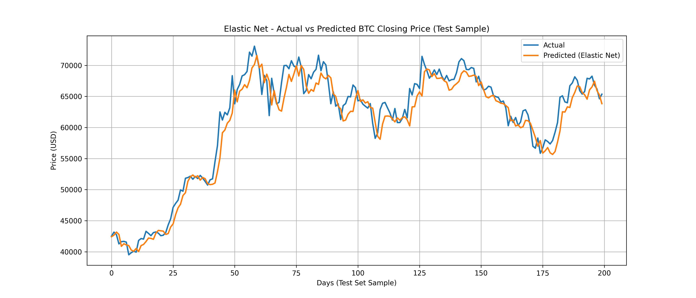
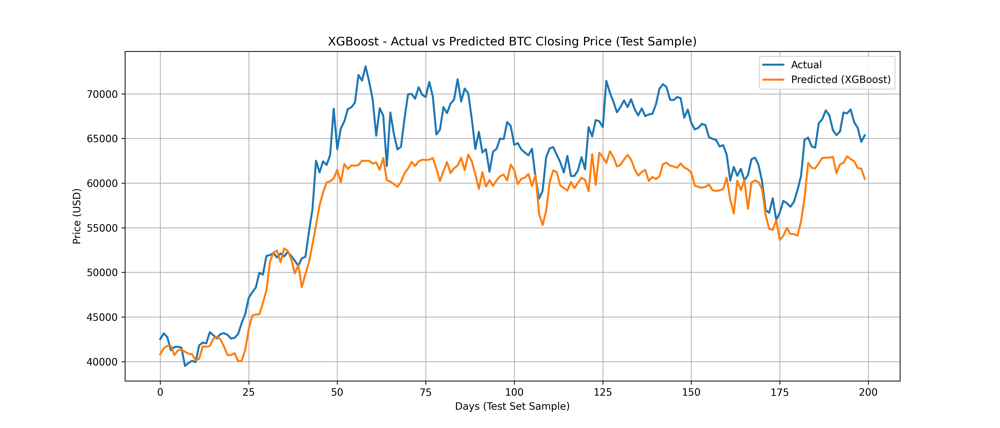
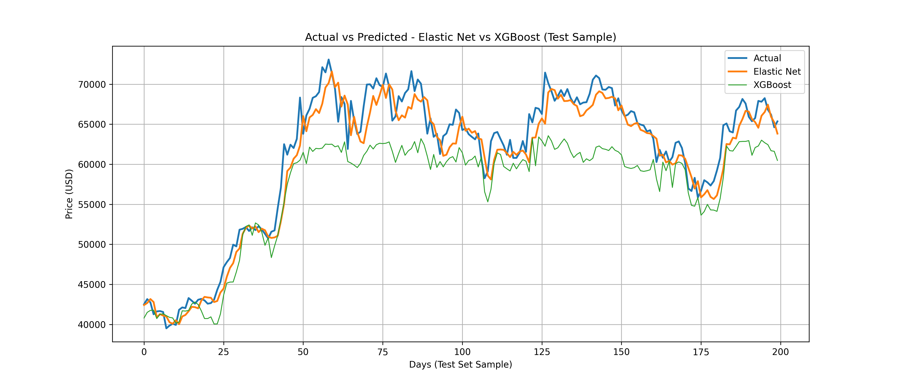
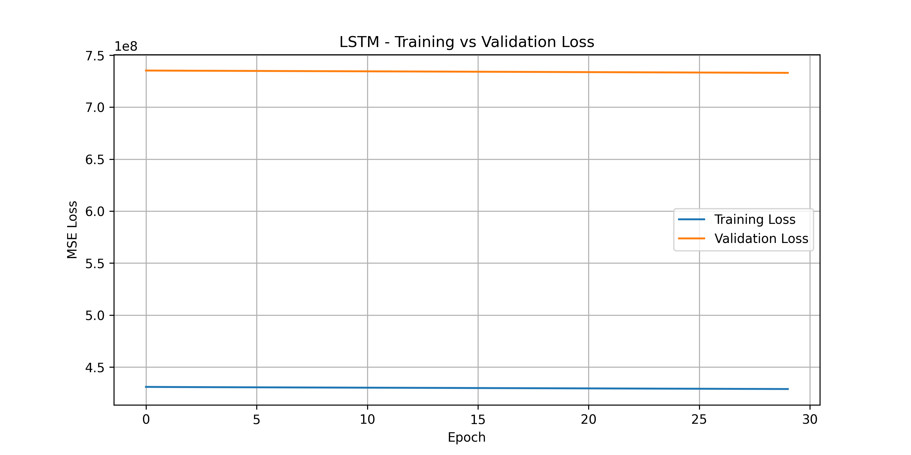

# Bitcoin Price / Trend Predictor

A comparative study of **Elastic Net**, **XGBoost**, and **LSTM deep learning** for forecasting next-day Bitcoin closing prices and market trend direction.

---

## Project Overview
Cryptocurrency markets are extremely volatile and reactive to external events, making reliable price prediction difficult.  
This project compares three AI model families to determine which approach generalizes best:

| Model Type | Model | Category |
|------------|--------|----------|
| Linear ML | Elastic Net | Baseline |
| Ensemble ML | XGBoost | Tree-based |
| Deep Learning | LSTM | Neural Network |

Goals  
- Predict the **next-day Bitcoin closing price**  
- Predict the **next-day price trend (up or down)**

---

## Dataset
- **4008 daily Bitcoin price records (2014 → 2025)**
- **109 engineered technical indicators**
  (RSI, MACD, moving averages, volatility measures, bull/bear regime flags, etc.)

**Target column:** `target_close_1d` → tomorrow’s closing price (t+1)

---

## Methodology
1. Sort dataset chronologically
2. Create prediction target by shifting close price -1 day
3. Handle missing values via forward-/back-filling
4. **Time-based split (not randomized)**
   - 70% Train | 15% Validation | 15% Test
5. Train & evaluate 3 models using identical metrics

---

## Evaluation Metrics

| Metric | Meaning |
|--------|---------|
| MAE | Mean Absolute Error |
| RMSE | Root Mean Squared Error |
| R² | Coefficient of Determination |
| Directional Accuracy | % of up/down movements correctly predicted |

---

## Model Performance (Test Set)

| Model | MAE | RMSE | R² | Directional Accuracy |
|--------|-----------|-------------|-----------|----------------------|
| **Elastic Net** | **2024** | **2639** | **0.985** | **51.5%** |
| XGBoost | 21903 | 29146 | -0.842 | 48.7% |
| XGBoost (Tuned) | 21052 | 28466 | -0.757 | 50.7% |
| LSTM | 81040 | 83839 | -14.239 | 47.0% |

**Key Finding:**  
> The simplest model (Elastic Net) outperformed more complex models due to its robustness against volatility and noise.

---

## Visualizations

### Elastic Net - Actual vs Predicted
  
<p align="center"><i>Elastic Net closely tracks price volatility and general market behavior.</i></p>

### XGBoost - Actual vs Predicted
  
<p align="center"><i>XGBoost shows overfitting and predicting spikes instead of stable trends.</i></p>

### Elastic Net vs XGBoost - Comparison
  
<p align="center"><i>Elastic Net generalizes significantly better than XGBoost on the same time period.</i></p>

### LSTM - Training / Validation Loss Curve
  
<p align="center"><i>Validation loss remains high despite decreasing training loss → poor generalization.</i></p>

---

## Reproducibility

### Dataset Access
You may download the dataset from Kaggle:  
https://www.kaggle.com/datasets/tarunsharma404/bitcoin-btc-usd-with-technical-indicators

Or use the version included in the repository:

/data/BTC_USD_COMPLETE_ANALYSIS.csv

### Run the Project
```bash
git clone https://github.com/jordisa20/BTC-Price-Predictor.git
pip install -r requirements.txt
jupyter notebook notebooks/bitcoin_main.ipynb
```
Run all cells top-to-bottom - no configuration changes required

## Tools & Frameworks
- Python 3.11
- Jupyter Notebook
- NumPy | Pandas | Scikit-Learn
- XGBoost
- TensorFlow / Keras
- Matplotlib

## System Requirements
- RAM: 8GB or higher recommended for LSTM model
- Python: 3.10+  
- GPU is **not** required - project runs on CPU

## Conclusion   
More complex models do not always outperform simpler ones in cryptocurrency forecasting. Elastic Net outperformed XGBoost and LSTM due to its resilience to volatility and extreme noise in Bitcoin price movements.

## Authors 
### **Team Members:** 
-
-
-
-
-
***Course: CAP 4630 - Introduction to Artificial Intelligence***
***Semester: Fall 2025*** 

---

## License  
This project is for educational purposes only. Redistribution without permission is not allowed.
